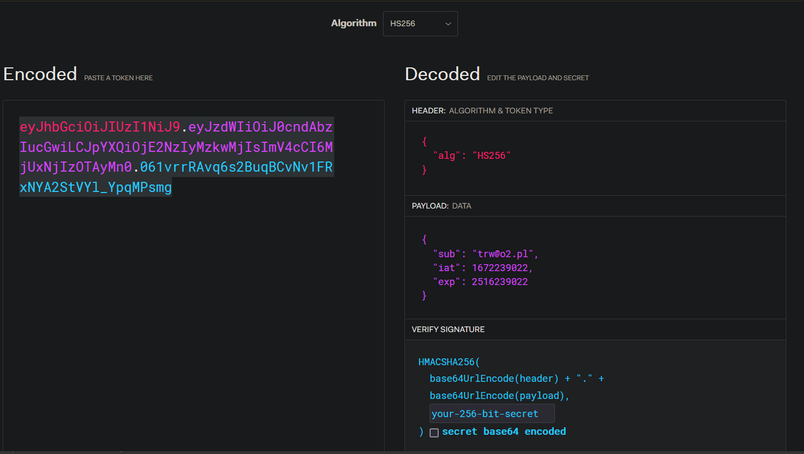

# Spring and PostgreSQL application
Spring application, which uses REST, DTOs and PostgreSQL database.

## Table of Contents
* [General Info](#general-information)
* [Technologies Used](#technologies-used)
* [Features](#features)
* [Screenshots](#screenshots)
* [Setup](#setup)
* [Usage](#usage)
* [Project Status](#project-status)
* [Room for Improvement](#room-for-improvement)

## General Information
This project was created to test the capabilities of Spring, Spring Security and PostgreSQL - especially JPA. OpenAPI allows to describe, consume and visualize RESTful web services.

## Technologies Used
Java, Spring, PostgreSQL, Docker, OpenAPI, Spring Security.

## Features
- Adding student,
- deleting student,
- getting all students,
- updating student,
- getting one student by email,
- validation of dates,
- checking if the email is correct,
- getting region and subregion from internet API based on student's country,
- registering user,
- authenticating user.

## Screenshots

## Setup
Start the application.
Operating port is 8090.
To start the application use command `docker compose up`. Database credentials are declared in docker-compose.yml - `POSTGRES_USER=postgres POSTGRES_PASSWORD=password POSTGRES_DB=testdatabase`. 
A JWT token is needed to register user and authorize requests. Create JWT token for example at
https://jwt.io/ and add it to header in `register` endpoint.  JWT token has specific syntax - subject is email.  Create user with correct email.

Created token will be used in requests or to authenticate user in `authenticate` endpoint.
## Usage
Tool Postman or OpenAPI are recommended. The available options are:
- adding student
- deleting student - DELETE http://localhost:8090/api/v1/student/{{studentId}}
- getting all students http://localhost:8090/api/v1/student
- updating student
- getting one student by email - GET http://localhost:8090/api/v1/student/{{email}}
- getting region and subregion from outside API based on student's country GET http://localhost:8090/api/v1/student/regionsByCountry/{studentId}
- OpenAPI option operates on different port:
- http://localhost/
## Project Status
Complete.

## Room for Improvement
OpenAPI and dockerization of Spring Security.

