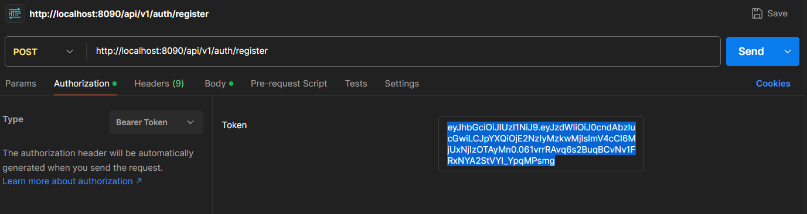
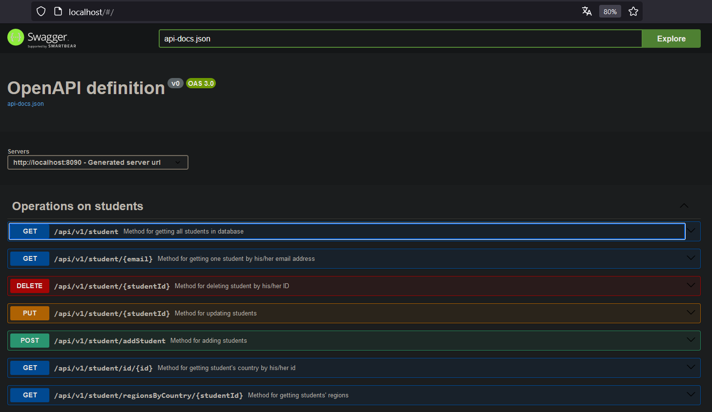

# Spring and PostgreSQL application
Spring application, which uses DTOs and PostgreSQL database.

## Table of Contents
* [General Info](#general-information)
* [Technologies Used](#technologies-used)
* [Features](#features)
* [Screenshots](#screenshots)
* [Setup](#setup)
* [Usage](#usage)
* [Project Status](#project-status)
* [Room for Improvement](#room-for-improvement)

## General Information
This project was created to test the capabilities of Spring and PostgreSQL - especially JPA. OpenAPI allows to describe, consume and visualize RESTful web services.

## Technologies Used
Java, Spring, PostgreSQL, Docker, OpenAPI.

## Features
- Adding student,
- deleting student,
- getting all students,
- updating student,
- getting one student by email,
- validation of dates,
- checking if the email is correct.

## Screenshots

 OpenAPI

## Setup
Start the application.
Operating port is 8090.
To start the application use command `docker compose up`. PgAdmin must be up - database credentials are declared in docker-compose.yml - `POSTGRES_USER=postgres POSTGRES_PASSWORD=password POSTGRES_DB=testdatabase`, 

## Usage
Tool Postman or OpenAPI are recommended. The available options are:
- adding student 
- deleting student - DELETE http://localhost:8090/api/v1/student/{{studentId}}
- getting all students http://localhost:8090/api/v1/student
- updating student 
- getting one student by email - GET http://localhost:8090/api/v1/student/{{email}}
OpenAPI option operates on different port:
- http://localhost/
## Project Status
Complete.

## Room for Improvement
To do:
- Add more functionalities

